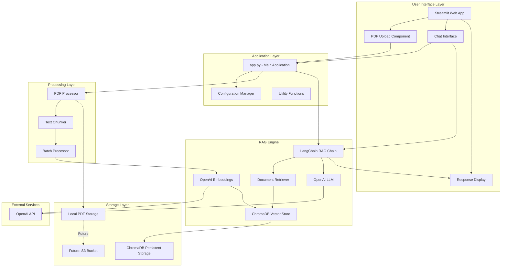
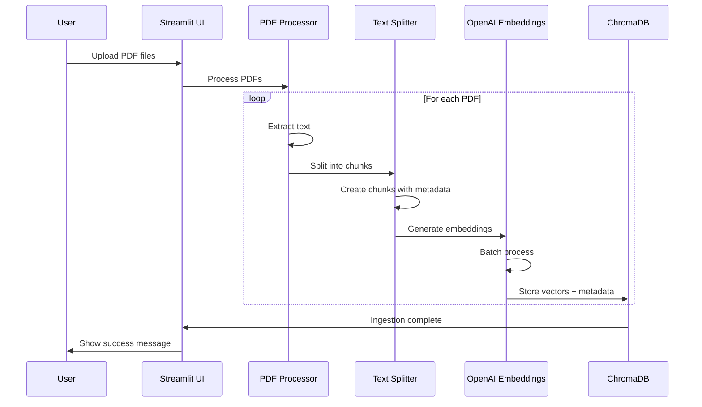
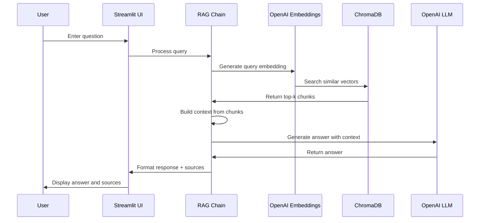
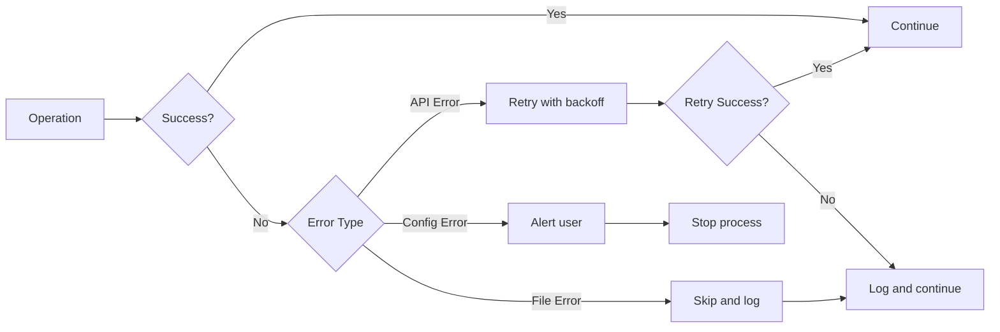
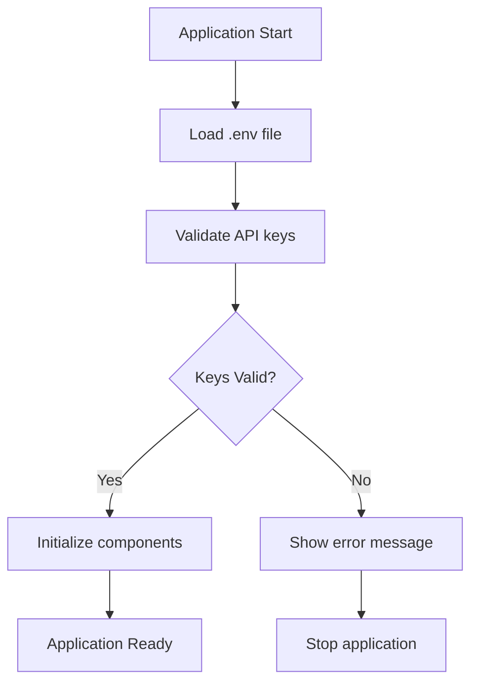
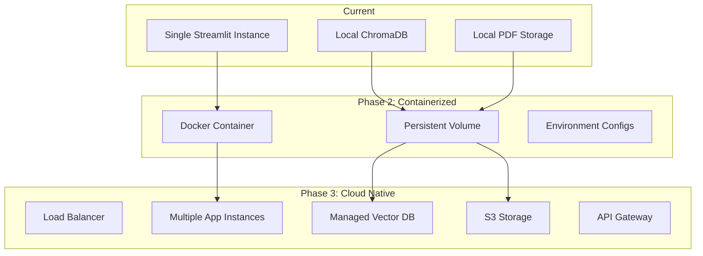
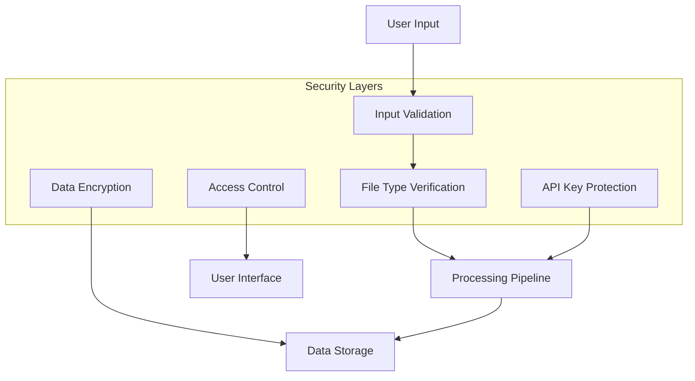
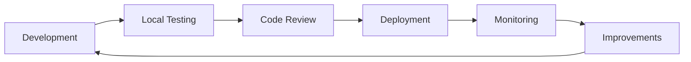

# RAG Chatbot System Design

## System Architecture Diagram



## Document Ingestion Flow



## Query-Answer Flow



## Component Interaction Matrix

| Component | Interacts With | Purpose |
|-----------|---------------|---------|
| Streamlit UI | App, PDF Processor, RAG Chain | User interaction and display |
| PDF Processor | OpenAI Embeddings, ChromaDB | Document ingestion |
| ChromaDB | RAG Chain, PDF Processor | Vector storage and retrieval |
| RAG Chain | ChromaDB, OpenAI LLM | Query processing and answer generation |
| OpenAI API | Embeddings, LLM | AI capabilities |
| Config Manager | All components | Settings and API keys |

## Data Models

### Document Chunk
```python
{
    "content": str,              # Text content of chunk
    "metadata": {
        "source": str,           # PDF filename
        "page": int,             # Page number
        "chunk_id": str,         # Unique chunk identifier
        "upload_date": datetime, # When document was uploaded
        "total_pages": int       # Total pages in source PDF
    }
}
```

### Query Request
```python
{
    "question": str,             # User's question
    "top_k": int,                # Number of chunks to retrieve
    "filters": dict              # Optional metadata filters
}
```

### Query Response
```python
{
    "answer": str,               # Generated answer
    "sources": [                 # List of source documents
        {
            "content": str,      # Chunk content
            "source": str,       # PDF filename
            "page": int          # Page number
        }
    ],
    "confidence": float          # Optional: confidence score
}
```

## State Management

### Streamlit Session State
```python
session_state = {
    "vector_store": ChromaDB,     # Initialized vector store
    "rag_chain": RAGChain,        # Initialized RAG chain
    "processed_files": list,      # List of processed PDF names
    "query_history": list,        # Previous queries and answers
    "current_documents": int      # Count of documents in store
}
```

## Error Handling Strategy



## Configuration Flow



## Scaling Considerations

### Current Architecture
- Single machine deployment
- Local ChromaDB storage
- Streamlit single-threaded

### Future Scalability Path



## Performance Optimization Points

### 1. Embedding Generation
- Batch multiple documents together
- Implement caching for previously embedded content
- Use async processing where possible

### 2. Vector Search
- Optimize top-k parameter (fewer = faster)
- Use metadata filtering to reduce search space
- Consider approximate nearest neighbor (ANN) for very large datasets

### 3. LLM Calls
- Set appropriate max_tokens limit
- Use streaming for better UX
- Implement response caching for common queries

### 4. Document Processing
- Process PDFs in parallel
- Use incremental indexing (only new documents)
- Implement checkpointing for large batches

## Security Architecture



## Monitoring and Logging

### Key Metrics to Track
1. **Ingestion Metrics**
   - PDFs processed per session
   - Average processing time per PDF
   - Failed ingestions and reasons

2. **Query Metrics**
   - Queries per session
   - Average response time
   - Retrieval quality scores

3. **System Metrics**
   - Vector store size
   - API usage and costs
   - Error rates

4. **User Metrics**
   - Session duration
   - Documents uploaded
   - Query patterns

## Development Workflow



## Technology Stack Summary

| Layer | Technology | Purpose |
|-------|-----------|---------|
| Frontend | Streamlit | Web UI |
| Backend | Python 3.10+ | Application logic |
| Framework | LangChain | RAG orchestration |
| Vector DB | ChromaDB | Embedding storage |
| Embeddings | OpenAI Ada-002 | Text vectorization |
| LLM | GPT-3.5/4 | Answer generation |
| PDF Processing | PyPDF/LangChain | Document parsing |
| Config | python-dotenv | Environment management |

## Implementation Priority

### Must Have (MVP)
1. PDF upload and processing
2. ChromaDB integration
3. Basic RAG chain
4. Simple Streamlit UI
5. Query and response display

### Should Have
1. Batch processing
2. Progress tracking
3. Source citations
4. Error handling
5. Configuration management

### Nice to Have
1. Query history
2. Document statistics
3. Advanced filtering
4. Response caching
5. Performance metrics

## Risk Mitigation

| Risk | Impact | Mitigation |
|------|--------|-----------|
| API costs | High | Implement rate limiting, use caching |
| Large file processing | Medium | Batch processing, progress tracking |
| Poor retrieval quality | High | Optimize chunking, tune top-k |
| Slow response time | Medium | Optimize retrieval, use faster models |
| Storage limits | Low | Monitor size, implement cleanup |

This system design provides a comprehensive blueprint for building the RAG chatbot while maintaining flexibility for future enhancements and AWS migration.